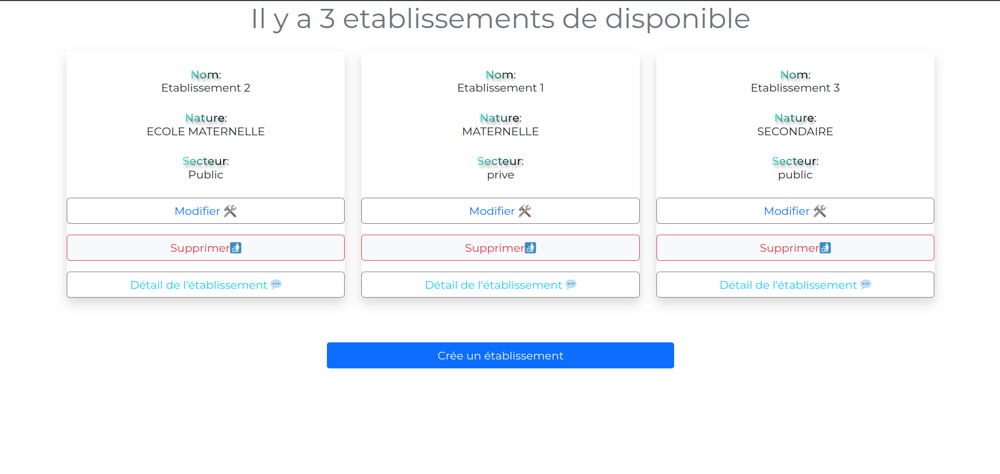
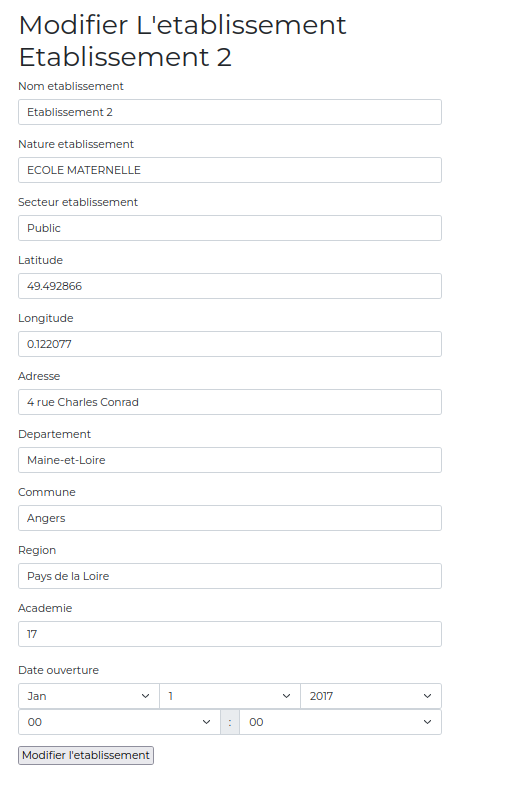
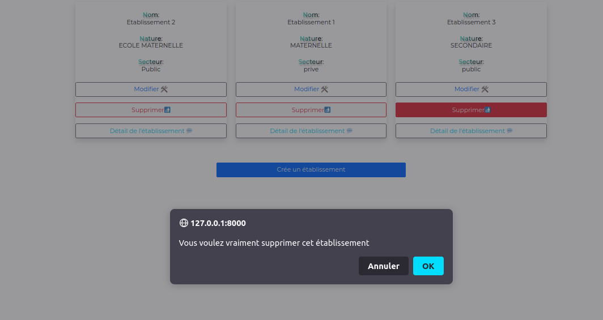
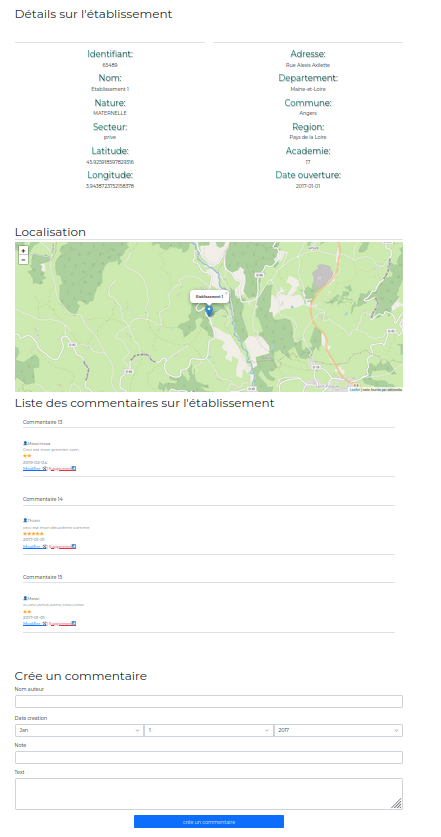

#  Etablissement croud #


## ***Plan*** ##

* [Etablissement Crud](#etablissement-crud)
   * [Travail realiser](#travail-realiser)
      * [Gestion des modèles de données](#gestion-modele)
      * [Gestion des formulaires](#gestion-fromulaire)
        * [Fromulaires](#formulaires)
        * [Controlleurs](#controlleurs)
        * [Vue Twig](#twig)
        * [Autres dossier](#dossier)
        * [Résultats](#resultat)
     
    
    


# ***Etablissement Crud*** #

<div id="travail-realiser" align="center"></div>

## ***Travail realiser*** ##

---

<div id="gestion-modele" align="center"></div>

### ***Gestion des modèles de données*** ###

---


__ Afin de pouvoir importer les données on a utilisé la fonction load  ___


<div id="gestion-fromulaire" align="center"></div>

### ***Gestion des formulaires*** ###

---

<div id="formulaires" align="center"></div>

#### ***Fromulaires*** ####

---

- À l'aide de la commande suivante on crée nos deux fichier nomType.php (formulaire)

```php
php bin/console make:form
```
- Résultat

> [CommentaireType](src/From/resources/CommentairesType.php)

> [EtablissemenType](src/From/EtablissementType.php) 

<div id="controlleurs" align="center"></div>

#### ***Controlleurs*** ####

---

- On utilise les controleur pour faire appelle au formulaires et ainsi afficher , mettre à jours , suprrimer ou crée les données

on peut on crée avec la commande 
```php
php bin/console make:controller

```

- Résultat 

> [Controleur commentaire](src/Controller/CommentaireController.php) 

> [Controleur Etablissement](src/Controller/EtablissementController.php) 

<div id="twig" align="center"></div>

#### ***Vue Twig*** ####

---

- Tout les fichiers de vue se trouve dans templates

> [Fichier de vue en Twig](templates/) 

<div id="dossier" align="center"></div>

#### ***Autres dossier*** ####

---

- Dossier assets : ici on met notre css personnaliser , on a utiliser webpack donc on a un fichier .scss au lieu de css

> [Assets](assets/)

<div id="resultat" align="center"></div>

#### ***Résultats*** ####

- ***Page d'accueil***



- ***Modification Etablissement***



- ***Suppression Etablissement***



- ***Détails Etablissement***

Cette page contient 

    1. Les détails de l'etablissement 

    2. La localisation sur la carte 

    3. Les commentaires

    4.Formulaire d'ajout des commentaires 


 